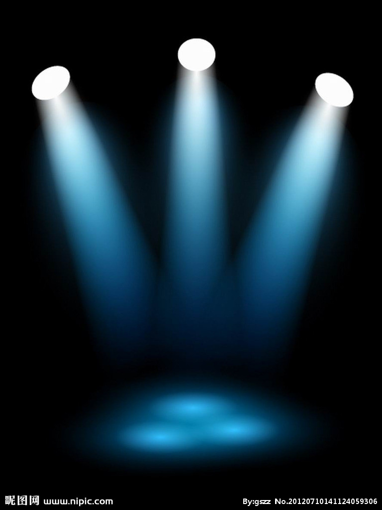

# there.js 学习笔记

## 三大组建
在Three.js中，要渲染物体到网页中，我们需要3个组建：场景（scene）、相机（camera）和渲染器（renderer）。
**有了这三样东西，才能将物体渲染到网页中去。**

创建这三要素的代码如下：
```
var scene = new THREE.Scene();  // 场景
var camera = new THREE.PerspectiveCamera(75, window.innerWidth/window.innerHeight, 0.1, 1000);// 透视相机
var renderer = new THREE.WebGLRenderer();   // 渲染器
renderer.setSize(window.innerWidth, window.innerHeight);    // 设置渲染器的大小为窗口的内宽度，也就是内容区的宽度
document.body.appendChild(renderer.domElement);
```


### 场景
在Threejs中场景就只有一种，用THREE.Scene来表示，要构件一个场景也很简单，只要new一个对象就可以了，代码如下：

> var scene = new THREE.Scene();

场景是所有物体的容器，如果要显示一个苹果，就需要将苹果对象加入场景中。

### 相机
另一个组建是相机，相机决定了场景中那个角度的景色会显示出来。相机就像人的眼睛一样，人站在不同位置，抬头或者低头都能够看到不同的景色。

场景只有一种，但是相机却又很多种。和现实中一样，不同的相机确定了呈相的各个方面。比如有的相机适合人像，有的相机适合风景，专业的摄影师根据实际用途不一样，选择不同的相机。对程序员来说，只要设置不同的相机参数，就能够让相机产生不一样的效果。

在Threejs中有多种相机，这里介绍两种，它们是：

透视相机（THREE.PerspectiveCamera）、这里我们使用一个透视相机，透视相机的参数很多，这里先不详细讲解。后面关于相机的那一章，我们会花大力气来讲。定义一个相机的代码如下所示：（已经迫不及待想看看相机的参数了，点这里）

> var camera = new THREE.PerspectiveCamera(75, window.innerWidth/window.innerHeight, 0.1, 1000);

### 渲染器
最后一步就是设置渲染器，渲染器决定了渲染的结果应该画在页面的什么元素上面，并且以怎样的方式来绘制。这里我们定义了一个WebRenderer渲染器，代码如下所示：
```
var renderer = new THREE.WebGLRenderer();
renderer.setSize(window.innerWidth, window.innerHeight);
document.body.appendChild(renderer.domElement);
```
注意: 渲染器 renderer 的 domElement 元素，表示渲染器中的画布，所有的渲染都是画在 domElement上 的，所以这里的 appendChild 表示将这个 domElement 挂接在 body 下面，这样渲染的结果就能够在页面中显示了。


## 光源

在Threejs中，光源用Light表示，它是所有光源的基类。它的构造函数是：

> THREE.Light(hex)

它有一个参数 `hex`，接受一个16进制的颜色值。例如要定义一种红色的光源，我们可以这样来定义：

> Var redLight = new THREE.Light(0xFF0000);

THREE.Light只是其他所有光源的基类，其他光源有：

- THREE.AmbientLight(hex) 环境光
- PointLight(color, intensity, distance) 点光源
- THREE.SpotLight(hex, intensity, distance, angle, exponent) 聚光灯
- THREE.DirectionalLight = function ( hex, intensity ) 方向光, 平行光
-

### 环境光

环境光是经过多次反射而来的光称为环境光，无法确定其最初的方向。环境光是一种无处不在的光。
环境光源放出的光线被认为来自任何方向。因此，当你仅为场景指定环境光时，所有的物体无论法向量如何，
都将表现为同样的明暗程度。 （这是因为，反射光可以从各个方向进入您的眼睛）

环境光用THREE.AmbientLight来表示，它的构造函数如下所示：

> THREE.AmbientLight(hex)

它仍然接受一个16进制的颜色值，作为光源的颜色。环境光将照射场景中的所有物体，让物体显示出某种颜色。环境光的使用例子如下所示：

```
var light = new THREE.AmbientLight(0xff0000);
scene.add(light);
```

只需要将光源加入场景，场景就能够通过光源渲染出好的效果来了。

### 点光源

点光源：由这种光源放出的光线来自同一点，且方向辐射自四面八方。例如蜡烛放出的光，萤火虫放出的光。

点光源用 PointLight 来表示，它的构造函数如下所示：

> PointLight(color, intensity, distance)

这个类的参数稍微复杂一些，我们花点时间来解释一下：

Color：光的颜色

Intensity：光的强度，默认是1.0,就是说是100%强度的灯光，

distance：光的距离，从光源所在的位置，经过distance这段距离之后，光的强度将从Intensity衰减为0。 默认情况下，这个值为0.0，表示光源强度不衰减。


### 聚光灯

聚光灯：这种光源的光线从一个锥体中射出，在被照射的物体上产生聚光的效果。使用这种光源需要指定光的射出方向以及锥体的顶角α。聚光灯示例如图所示：



聚光灯的构造函数是：

> THREE.SpotLight( hex, intensity, distance, angle, exponent )

函数的参数如下所示：

Hex：聚光灯发出的颜色，如0xFFFFFF

Intensity：光源的强度，默认是1.0，如果为0.5，则强度是一半，意思是颜色会淡一些。和上面点光源一样。

Distance：光线的强度，从最大值衰减到0，需要的距离。 默认为0，表示光不衰减，如果非0，则表示从光源的位置到Distance的距离，光都在线性衰减。到离光源距离Distance时，光源强度为0.

Angle：聚光灯着色的角度，用弧度作为单位，这个角度是和光源的方向形成的角度。

exponent：光源模型中，衰减的一个参数，越大衰减约快。

### 平行光

平行光又称为方向光（Directional Light），是一组没有衰减的平行的光线，类似太阳光的效果。

方向光的构造函数如下所示：

> THREE.DirectionalLight = function ( hex, intensity )

其参数如下：

Hex：关系的颜色，用16进制表示

Intensity：光线的强度，默认为1。因为RGB的三个值均在0~255之间，不能反映出光照的强度变化，光照越强，物体表面就更明亮。它的取值范围是0到1。如果为0，表示光线基本没什么作用，那么物体就会显示为黑色。


## MeshLambertMaterial 与 MeshBasicMaterial 区别

不加灯光的时候 一个看得见 一个看不见 由材质决定的。

## 参考资料
[WebGL中文网](http://www.hewebgl.com/)

[Three.js入门指南](http://www.ituring.com.cn/minibook/792)

[stats性能监控](https://github.com/mrdoob/stats.js/)

[Tween动画](https://github.com/tweenjs/tween.js)

[dat.gui控制器](https://github.com/dataarts/dat.gui)

[dat.gui控制器文档](http://workshop.chromeexperiments.com/examples/gui/#1--Basic-Usage)

[深入理解Three.js（WebGL）贴图（纹理映射）和UV映射](http://www.techbrood.com/zh/news/webgl/%E6%B7%B1%E5%85%A5%E7%90%86%E8%A7%A3three_js%E7%BA%B9%E7%90%86%E8%B4%B4%E5%9B%BE%E5%92%8Cuv%E6%98%A0%E5%B0%84.html)

[深入理解Three.js（WebGL）贴图（纹理映射）和UV映射 (原文)](https://www.solutiondesign.com/blog/-/blogs/webgl-and-three-js-texture-mappi-1/)